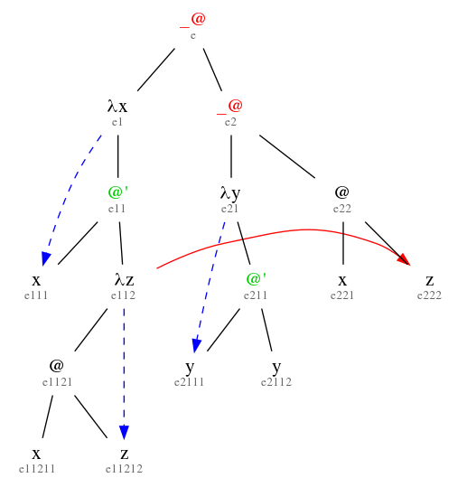

# _lambda

This is the OCaml code to accompany the alpha avoidance project. Run the following commands to run it:

1. `ledit ocaml`
2. `#use "_lambda.ml";;`

## Dot

The command `export_all t1 "dot/" "t1";;` exports different variations of the term (lifted, in normal form, fixed, ...) as dot graph in the given directory *dot/* (has to exist).

To convert a dot-graph into a png run the following command:

`dot -Tpng input.dot > output.png`

Make sure you have *graphviz* installed

